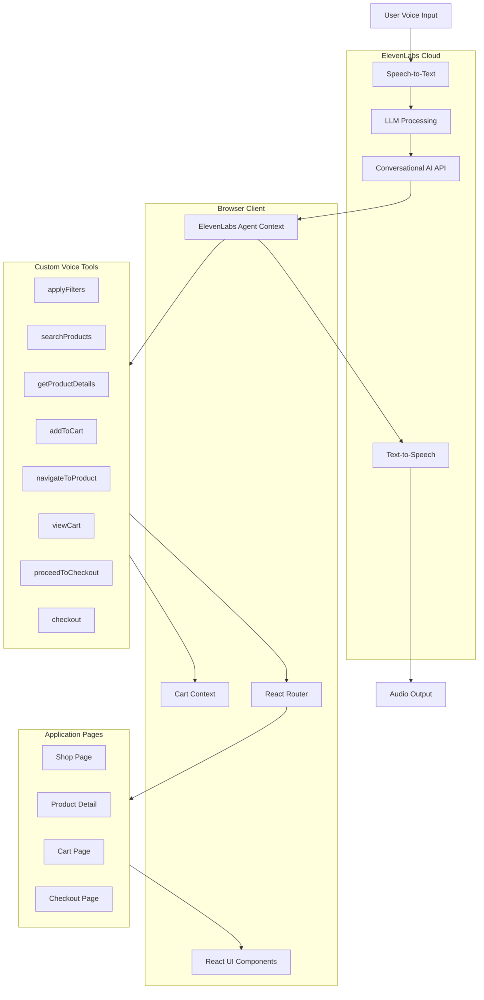
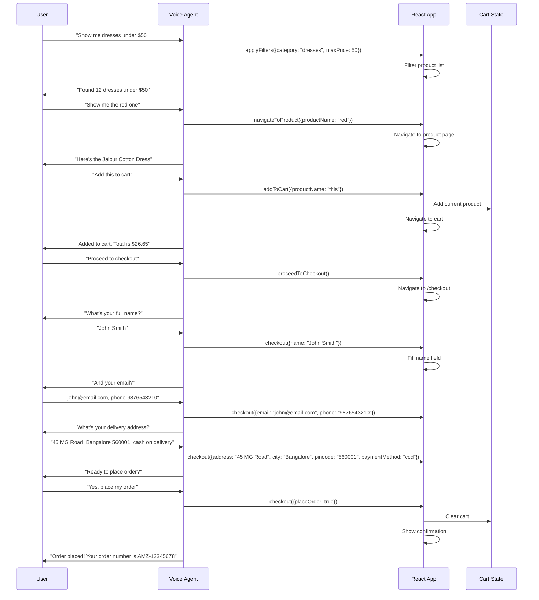

# VoiceShop: AI-Powered Voice Commerce

A fully voice-controlled e-commerce experience built for the **ElevenLabs x v0 Hackathon**. Browse products, apply filters, add to cart, and complete checkout entirely through natural voice commands.

## What It Does

VoiceShop transforms online shopping into a hands-free, conversational experience. Users interact with an AI voice agent that understands natural language commands like "Show me red dresses under $50" or "Add this to my cart" and executes them in real-time. The entire shopping journey from product discovery to order confirmation happens through voice, eliminating the need for clicking, typing, or navigating complex menus.

## Architecture



## ElevenLabs Integration

VoiceShop uses the ElevenLabs Conversational AI SDK to create a real-time voice agent that runs entirely in the browser.

### How It Works

**Voice Connection**: The app establishes a WebSocket connection to ElevenLabs using the Conversation API. Users click "Voice Filter" to connect their microphone and start the session.

**Speech Recognition**: User speech is streamed to ElevenLabs where it is transcribed in real-time using their speech-to-text engine.

**Intent Processing**: The transcribed text is processed by an LLM that determines user intent and selects the appropriate tool to execute. Tool definitions are configured in the ElevenLabs dashboard with JSON schemas.

**Tool Execution**: When a tool is selected, ElevenLabs sends a callback to the client with the tool name and parameters. The app executes the tool locally (filtering products, adding to cart, navigating pages) and returns a response.

**Voice Response**: The tool response is sent back to ElevenLabs, processed by the LLM to generate a natural language reply, and converted to speech using ElevenLabs TTS. The audio streams back to the user.

### Custom Voice Tools

| Tool | Purpose |
|------|---------|
| `applyFilters` | Filter products by category, price, color, brand, shipping |
| `searchProducts` | Search products by name or keyword |
| `getProductDetails` | Retrieve detailed info about a specific product |
| `addToCart` | Add products to cart with quantity, supports "add this" context |
| `navigateToProduct` | Navigate to a product detail page |
| `viewCart` | Navigate to cart and read cart summary |
| `proceedToCheckout` | Move from cart to checkout form |
| `checkout` | Fill checkout form fields and place order |

### Context Awareness

The agent maintains context about what the user is viewing. On a product detail page, users can say "Add this to cart" without naming the product. The app registers the current product with the agent context, and the tool resolves pronouns like "this", "it", or "current" to the active product.

## Tech Stack

| Layer | Technology |
|-------|------------|
| Framework | React 19, TypeScript |
| UI Development | v0 by Vercel |
| Components | shadcn/ui, Radix UI |
| Styling | Tailwind CSS v4 |
| Routing | React Router v6 |
| Voice AI | ElevenLabs Conversational AI |
| State | React Context API |
| Data Fetching | SWR |

## Project Structure

```
src/
├── contexts/
│   ├── ElevenLabsAgentContext.tsx  # Voice agent state and tool handlers
│   └── CartContext.tsx             # Shopping cart state
├── pages/
│   ├── Shop.tsx                    # Product listing with voice filters
│   ├── Product.tsx                 # Product detail page
│   ├── Cart.tsx                    # Cart review page
│   └── Checkout.tsx                # Checkout form page
├── components/
│   ├── Layout.tsx                  # App shell with voice status
│   ├── Header.tsx                  # Navigation header
│   ├── DebugPanel.tsx              # Voice tool call logger
│   └── VoiceFilterButton.tsx       # Voice connection toggle
├── hooks/
│   └── useElevenLabsAgent.ts       # Agent connection hook
├── utils/
│   └── debugLogger.ts              # Tool call logging utility
└── data/
    └── products.ts                 # Product catalog

elevenlabs-tools/                   # Tool JSON schemas for ElevenLabs dashboard
├── 1-applyFilters.json
├── 2-searchProducts.json
├── 3-getProductDetails.json
├── 4-addToCart.json
├── 5-navigateToProduct.json
├── 6-viewCart.json
├── 7-checkout.json
└── 8-proceedToCheckout.json
```

## User Flow



## Getting Started

### Prerequisites

Node.js 18+ and an ElevenLabs account with Conversational AI access.

### Installation

```bash
npm install
```

### Environment Variables

Create a `.env.local` file:

```
VITE_ELEVENLABS_AGENT_ID=your_agent_id_here
```

### ElevenLabs Setup

1. Create a new Conversational AI agent in the ElevenLabs dashboard
2. Add each tool from the `elevenlabs-tools/` folder to your agent
3. Configure the system prompt to guide conversational checkout flow
4. Copy the Agent ID to your environment variables

### Run Development Server

```bash
npm run dev
```

## Voice Commands Reference

| Intent | Example Phrases |
|--------|-----------------|
| Filter by category | "Show me dresses", "I want to see keyboards" |
| Filter by price | "Under $50", "Between $20 and $100" |
| Filter by color | "Show red items", "Only blue ones" |
| Filter by brand | "Show Nike products" |
| Free shipping | "With free delivery", "Free shipping only" |
| View product | "Tell me about the first one", "Show me the wireless headphones" |
| Add to cart | "Add this to cart", "Add 2 of these" |
| View cart | "Open my cart", "What's in my cart" |
| Checkout | "Proceed to checkout", "I want to buy this" |
| Fill details | "My name is John", "Email is john@test.com" |
| Payment | "Pay by UPI", "Cash on delivery", "Card payment" |
| Place order | "Place my order", "Confirm order" |

## Built For

**ElevenLabs x v0 Hackathon**

This project demonstrates how conversational AI can transform e-commerce into an accessible, hands-free experience. Voice-powered shopping benefits users with accessibility needs, those multitasking, or anyone who prefers natural conversation over traditional UI navigation.

## License

MIT
